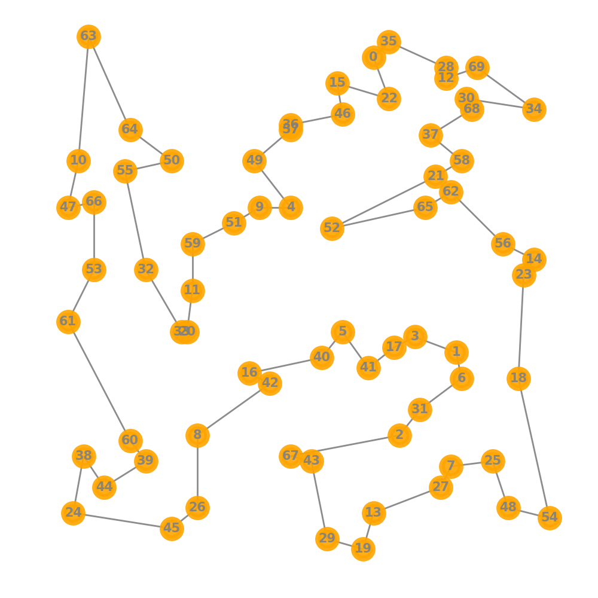

# TSP - Travelling Salesman Problem

Implementation of the TSP problem in python

##### In the `src` package you can find the following classes:

- `prepare_resources` use this file in order to convert the `.tsp` file into a `.csv` file
- `utility` contains a set of useful methods in order to develop the problem
- `resources.py` contains a set of useful elements for the project (e.g., optimal tour of the problem)
- `tsp.py` contains the implementation of the following algorithms: 
  * `nearest_neighbor`
  * `2-opt`
  * `3-opt`

---
`TSP.pdf` contains a report of the project

[Guide to print graph](https://codereview.stackexchange.com/questions/208387/2-opt-algorithm-for-the-traveling-salesman-and-or-sro)

Example of st-70 problem after `nearest neighbour`:

Example of st-70 problem after `2-opt` and `3-opt`:

